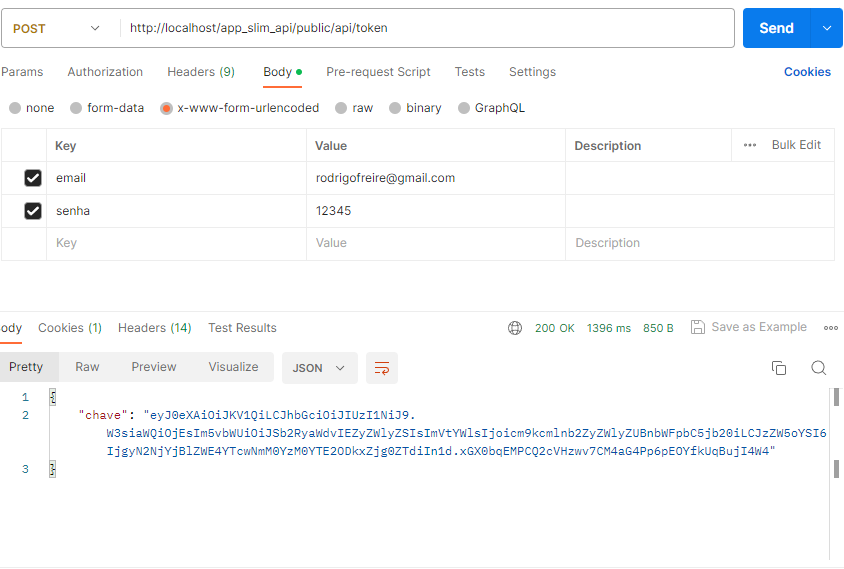
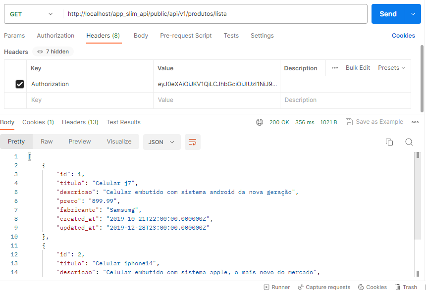

<h1 align="center"> Slim2 </h1>

<h3 align="center">API com acesso via browser necessitando autenticacao e usando BD</h3>

<h3 align="center">Simulação da página de requisição do token de autenticação</h3>

<h3 align="center">Simulação da página de requisição dos dados do BD</h3>

